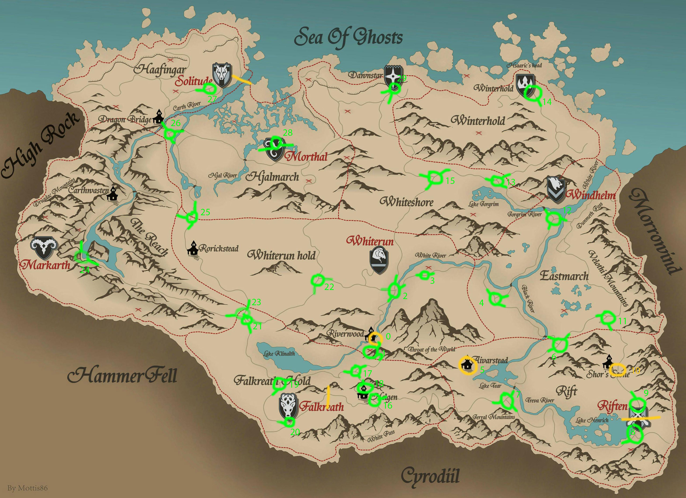

# Wanderlust
A bot that explores Tamriel on foot.

Supports: Skyrim LE



Install the mod and use the Wanderlust mod configuration menu (esc > Mod Configuration > Wanderlust) to start and stop the wandering mode.

## Set up

Required mods:
- [Skyrim Script Extender (SKSE)](https://www.nexusmods.com/skyrim/mods/100216)
- [SkyUI](https://www.nexusmods.com/skyrim/mods/3863)

Recommended mods:
- [One With Nature](https://www.nexusmods.com/skyrim/mods/54090): change all animals to not be aggressive
- ~~[No Random Dragons](https://www.nexusmods.com/skyrim/mods/14519/): disable random dragon spawns~~
- ~~[Skyrim Unbound](https://www.nexusmods.com/skyrim/mods/71465/): disable all dragon spawn~~

Recommended Skyrim.ini changes (in Documents/My Games/Skyrim):
```
[General]
bAlwaysActive=1
fDefaultFov=80
uGridsToLoad=8
uExterior Cell Buffer=81
[Camera]
fAutoVanityModeDelay=9999999
```

Recommended changes to game settings:
- Disable crosshair
- Dim HUD so it's less distracting

Recommended console cheats:
```sh
tgm
tmm 0 # rediscover every location again
```

Make sure to load up a save from before the player has picked up the [Dragonstone](https://elderscrolls.fandom.com/wiki/Dragonstone) to disable random dragon attacks. Ideally, this is a clean save where the intro quest is complete and the player is in the open world.

## Dev environment set up

- VS Code
- https://github.com/joelday/papyrus-lang/wiki/Papyrus-Project

## Helpful links
- Detailed Tamriel map: https://srmap.uesp.net/
- MCM states: http://www.gamesas.com/trying-make-mcm-configeration-menu-t409508.html
- Creation Kit documentation: https://www.creationkit.com/index.php?title=Quest_Alias_Tab

Skyrim.ini changes for logging:
```
[Papyrus]
fPostLoadUpdateTimeMS=500.0
bEnableLogging=1
bEnableTrace=1
bLoadDebugInformation=1
```

Tips:
- You need to reload a save from before you created an object in game if you make changes to an object and want to test the changes in game